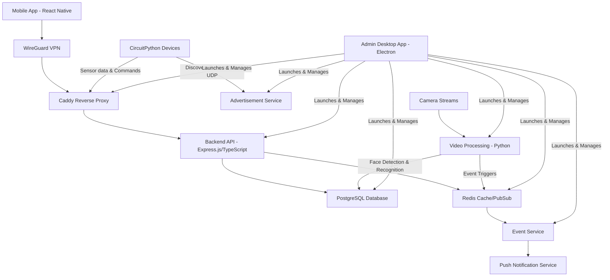

# Home Security System

_A comprehensive, scalable IoT security solution with real-time monitoring and notifications_

[](https://www.typescriptlang.org/)
[](https://reactnative.dev/)
[](https://www.docker.com/)
[](https://www.postgresql.org/)
[](https://redis.io/)

## Project Overview

A production-ready, enterprise-grade home security system designed for non-technical users, featuring distributed microservices architecture, real-time monitoring, and cross-platform mobile applications.
All achieved locally without heavy dependency on cloud infra (apart from push notifications and remote access where a centralised service needs to be made).


## System Architecture

### Core Components



### Infrastructure Design

- **Local Server**: Electron-based admin application with Docker orchestration
- **Microservices**: Containerized services with independent scaling
  - Node.js API backend for device management and business logic
  - Python video processing service for AI-powered surveillance
- **Network Layer**: Caddy reverse proxy with HTTPS/WSS termination and WireGuard VPN for remote devices
- **Mobile Client**: React Native app with remote connectivity via WireGuard VPN
- **IoT Devices**: CircuitPython-based sensors, alarms and cameras with local network discovery


## Project Status

**Note: This is an active development project and is no where near finished**

### Completed Components

- **Node.js Backend API** - Full TypeScript implementation with Express.js
- **PostgreSQL Database** - Complete schema with Drizzle ORM
- **Redis Integration** - Caching and pub/sub messaging
- **CircuitPython IoT Devices** - Sensor and alarm microcontrollers

### In Development

- **Frontend Applications** - React Native mobile app and Electron admin interface need significant work
- **Admin Application** - Requires complete overhaul for better UX
- **WireGuard VPN Service** - Not yet implemented
- **Integration Testing** - Cross-service communication and deployment
- **Python Video Processing Backend** - implemented a dummy version but not done efficiently


## Technical Highlights

### Backend & Infrastructure

- **Express.js API** with TypeScript for type safety and maintainability
- **Python Video Processing** with YOLO object detection and face recognition
- **PostgreSQL** with Drizzle ORM for robust data persistence
- **Redis** for real-time caching and pub/sub messaging
- **Docker Compose** orchestration for service management
- **Caddy** reverse proxy with automatic HTTPS and load balancing

### Frontend & Mobile

- **React Native** cross-platform mobile application
- **Electron** desktop admin interface
- **Real-time WebSocket** connections for live updates

### DevOps & Networking

- **WireGuard VPN** for secure remote access
- **UDP broadcasting** for automatic device discovery
- **Containerized deployment** with Docker
- **HTTPS/WSS** secure communications
- **Network segmentation** with proper firewall rules

### IoT & Hardware Integration

- **CircuitPython** microcontroller programming
- **Local network discovery** via UDP broadcasting
- **Real-time sensor monitoring** with sub-second response times
- **Hardware abstraction** for multiple device types

### AI & Computer Vision

- **YOLO v11** object detection for real-time surveillance
- **Face detection and recognition** using InceptionResnetV1
- **Multi-threaded video processing** with dynamic worker scaling
- **GPU acceleration** with CUDA support and memory optimization
- **Performance monitoring** with detailed metrics and logging


## Key Features

### Security & Monitoring

- Real-time door sensor monitoring
- Automated alarm triggering
- AI-powered video surveillance with YOLO object detection
- Face detection and recognition for person identification
- Push notifications via Expo/Firebase
- Secure device authentication
- End-to-end encryption

### User Experience

- Remote monitoring capabilities
- Real-time status updates
- Historical event logging

### System Administration

- Electron-based admin dashboard
- Docker service management
- System health monitoring
- Configuration management
- Log aggregation and analysis


## Technology Stack

### Backend Services

```typescript
// Core Technologies
- Node.js + Express.js + TypeScript
- Python + OpenCV + YOLO + PyTorch
- PostgreSQL + Drizzle ORM + SQLAlchemy
- Redis (Cache + PubSub)
- Docker + Docker Compose
- Caddy (Reverse Proxy)
```

### Frontend Applications

```typescript
// Mobile & Desktop
- React Native (iOS/Android)
- Electron (Desktop Admin)
- WebSocket (Real-time Communication)
- Expo (Push Notifications)
```

### Infrastructure & DevOps

```yaml
# Deployment Stack
- Docker Containerization
- WireGuard VPN
- HTTPS/TLS Termination
- UDP Network Discovery
- Microservices Architecture
```

### IoT & Hardware

```python
# Embedded Systems
- CircuitPython
- Microcontroller Programming
- Sensor Integration
- Network Communication
```


## Performance & Scalability

- **Sub-second response times** for sensor events
- **Horizontal scaling** via containerized microservices
- **Efficient caching** with Redis for frequently accessed data
- **Optimized database queries** with proper indexing
- **Real-time event processing** with pub/sub architecture

## Security Implementation

- **Device authentication** with secure API keys
- **Network segmentation** between IoT devices and internet
- **VPN-based remote access** for enhanced security
- **HTTPS/WSS encryption** for all communications
- **Input validation** and sanitization throughout


## Business Value

### For End Users

- **Plug-and-play setup** requiring minimal technical knowledge
- **Cost-effective** alternative to commercial security systems which rely heavily on the cloud
- **Privacy-focused** with local data processing

### Technical Achievements

- **Microservices architecture** enabling independent service scaling
- **Cross-platform compatibility** (iOS, Android, Windows, macOS, Linux)
- **Real-time data processing** with sub-second latency
- **AI-powered surveillance** with modern computer vision techniques


## Getting Started

Not recommended as it is not finished but

### Quick Start

```bash
# Clone the repository
git clone https://github.com/DLesas/home_security.git
cd home_security

# Start the admin application
cd adminApp
npm install
npm start

# The admin app will handle Docker service orchestration
```
